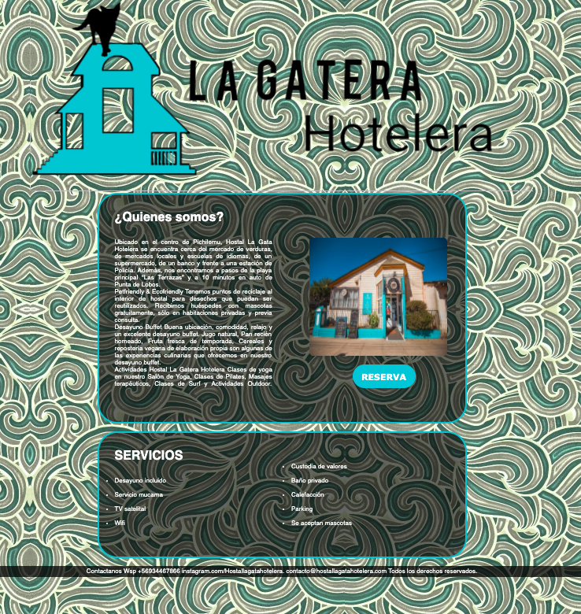
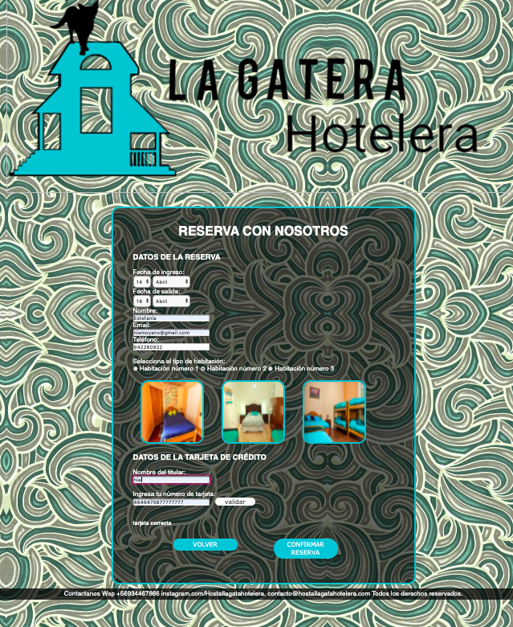
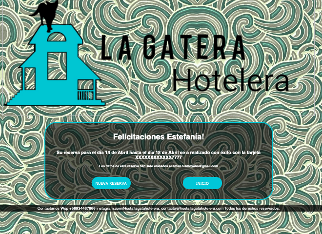
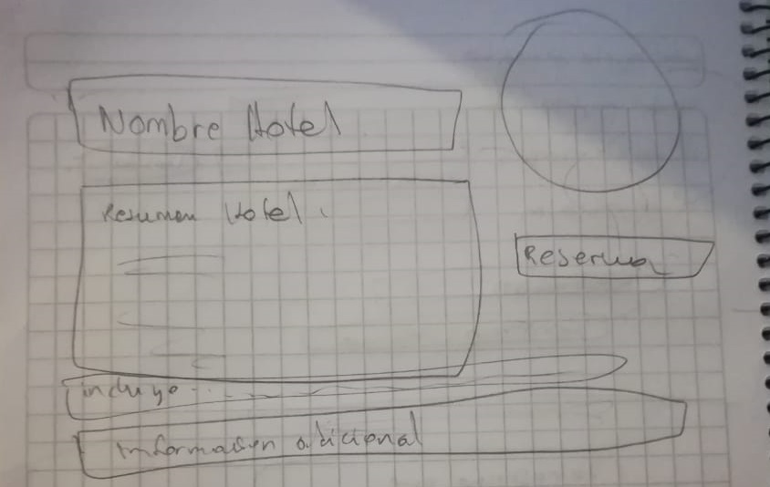
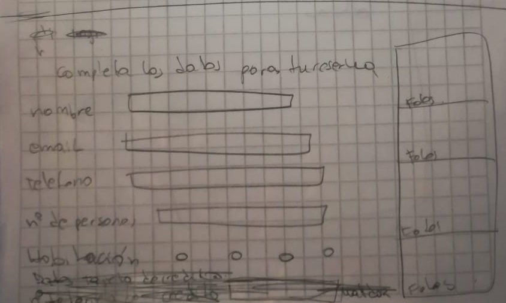
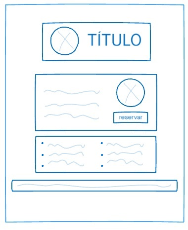
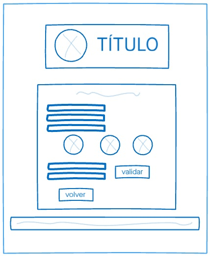
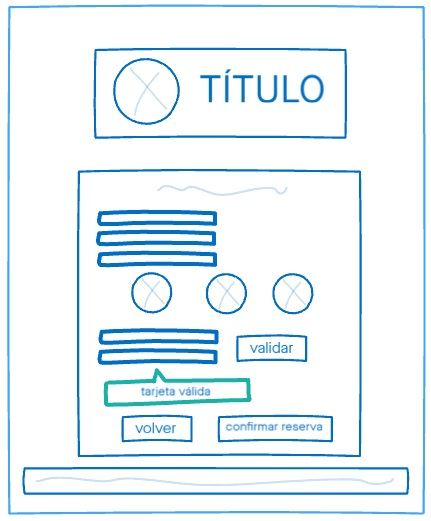

# HOSTAL LA GATERA HOTELERA :smiley_cat:prueba

_Nuestro proyecto consiste en la página web de un hostal de playa. En esta página podrás conocer un poco más sobre la historia e instalaciones del hostal y te permitirá realizar una reserva en las dependencias del él._

### Imagen final del proyecto:ocean:

* [Página La gatera hotelera](https://valeriaconstanzabc.github.io/SCL013-card-validation/src/index.html)

## Investigación UX :mag_right:

### ¿Quiénes son los usuarios y los objetivos en relación con el producto?
* Nuestro público esta dentro del rango etario considerado "adulto Joven" [27-40 años].Por esto nuestro diseño mezcla 
tanto la esencia hippie del hostal con toques modernos (colores, y juegos de transparencia) para que nuestrxs
usuarios se sientan atraídos por el ambiente que se vive en el hostal. Ademas la web cuenta con un formulario simple e intuitivo para poder reservar.

### ¿Cómo el producto soluciona los problemas/necesidades de dichos usuarios?
* Al ser una web intuitiva (pues tiene botones grandes, llamativos, y en español que indican la "acción" a seguir), logra que el usuario pueda realizar su reserva y validar su tarjeta en la misma página sin necesidad de recurrir a una página externa. 

### Primer prototipo en papel.

### Decisiones de diseño.
* Utilizamos una paleta de colores que evoca el mar y la playa, integrando tonos azules y celestes en los marcos, fondo, logo y botones.
* Para los contenedores de información utilizamos un gris que contrasta con el tono del fondo, y agregamos un porcentaje de transparencia para hacerlo más dinámico con relación al mar.
* Todos los vértices en nuestra página son redondeados. Esto nos entrega mayor cercanía y confianza, que es lo que el hostal quiere transmitir a sus clientes.
* El fondo lo mantuvimos un poco más translucido para que no compitiera con los títulos y párrafos que contiene la página.
* En cuanto a los botones, decidimos dejarlos llamativos en cuanto a su color, logrando ser intuitivos para quien visite nuestra página.

### Feedback recibido indicando las mejoras a realizar.
* Uno de los feedback que recibimos de parte de nuestras compañeras, fue que todas nuestras páginas estuvieran enlazadas entre sí, por lo que agregamos un nuevos botones para volver al index principal.
* Otro de los feedback fue el agrandar el logo del hostal y enlazarlo a la página principal, ya que no resultaba atractivo ni funcional.

### Prototipo final.

* [Prototipo animado](https://valeriabrito679410.invisionapp.com/public/share/3F13FRZWZ4#screens/477294219) - Prototipo realizado con InVision

---
⌨️❤️ by Estefania Moyano/ Valeria Brito
